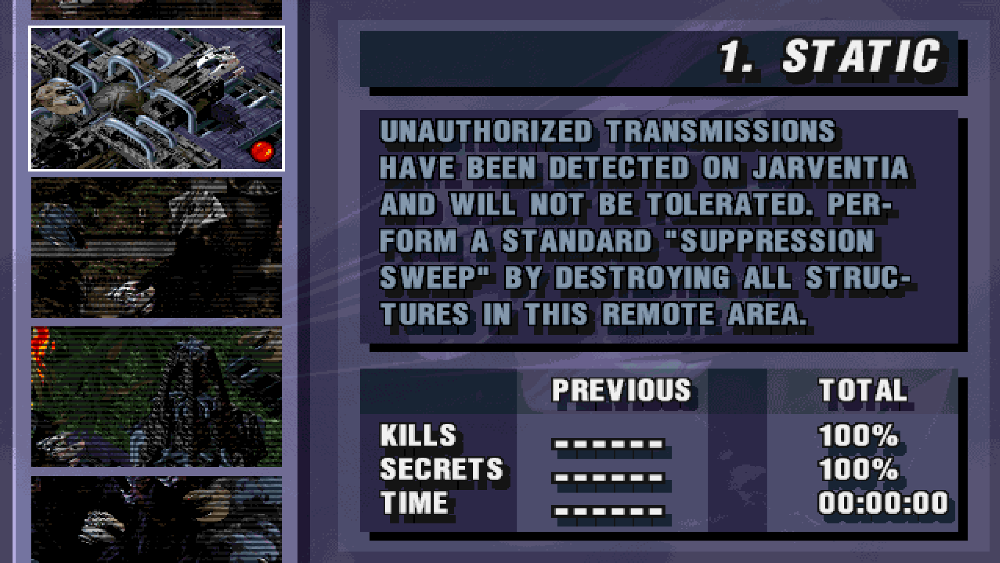

# Fire Fight (1996) - Modern Windows Compatibility



Run the original Windows version of **Fire Fight (1996)** on modern versions of Windows using **DxWnd**.

Tested on:
- Windows 11
- DxWnd v2.06.14
- Windows version of Fire Fight

---

## Features

- ✔ Original game executable
- ✔ Fullscreen support
- ✔ Windows 11 tested
- ✔ No virtual machine required
- ✔ No unofficial executable patch required
- ✔ Portable DxWnd profile included

---

## Requirements

You will need:

- A copy of the Windows version of Fire Fight (I got mine from MyAbandonware.com)
- DxWnd v2.06.14 (or newer)
- The included DxWnd profile

This project does **not** include any game files.

---

## Installation

### 1. Edit CWE.ini

Open CWE.ini using Notepad.

Locate the `[spr]` section and add:

```ini
use_640x400 = yes
use_320x200 = no
```

Save the file.

---

### 2. Import the DxWnd profile

Open DxWnd.

Select:

File → Import

Import:

Fire Fight - Windows 11.dxw

If prompted, browse to your copy of:

FIREFGHT.EXE

---

### 3. Launch the game

Launch the game **from DxWnd**.

Do **not** launch FIREFGHT.EXE directly.

---

## Included screenshots

See the screenshots folder for reference images showing the required DxWnd settings and the game running successfully.

---

## Credits

Compatibility profile created and tested by Cziko

Fire Fight © Chaos Works.

DxWnd © The DxWnd Project.
